<div align="center">

# 👨‍💻 Somanath Pattanashetti


<br/>

[](https://www.linkedin.com/in/somanath-pattanashetti/)
[](mailto:somanath.dev@gmail.com)
[](https://github.com/somanathp18)

</div>

---

<div align="center">

## 🌟 About Me

</div>

```yaml
name: "Somanath Pattanashetti"
role: "Embedded Systems Engineer & Full Stack Developer"
education: "Electronics & Communication Engineering"
current_focus: ["AI Agents", "n8n Automation", "LangChain", "Smart IoT Solutions"]
motto: "Stay curious, build smart, and keep pushing limits 🚀"
```

<div align="center">

### 🎯 What I'm Up To

🔬 **Exploring** AI integration with embedded systems  
🛠️ **Building** smart automation solutions  
🤖 **Developing** AI agents and workflow automation  
📡 **Connecting** hardware with intelligent software  

</div>

---

<div align="center">

## ⚡ Tech Arsenal

</div>

### 💻 **Core Programming**
<div align="center">


</div>

### 🌐 **Web Development**
<div align="center">


</div>

### 🗄️ **Databases**
<div align="center">


</div>

### 🔧 **Tools & Platforms**
<div align="center">


</div>

### ⚙️ **Embedded & Hardware**
<div align="center">


</div>

**🔌 Protocols:** UART • SPI • I2C • CAN  
**⚡ Peripherals:** ADC • PWM • DAC • Timers • Interrupts

---

<div align="center">

## 🚀 Featured Projects

</div>

<table align="center">
<tr>
<td width="50%">

### 🚘 **Car Black Box System**
**Advanced accident detection & logging**
- Real-time data capture using PIC18F4580
- EEPROM data storage & UART communication
- Comprehensive crash analysis system

**Tech:** `Embedded C` `UART` `EEPROM` `PIC18F`

</td>
<td width="50%">

### 🔐 **Secure Django Login System**
**Enterprise-grade authentication platform**
- Advanced session management
- Secure user authentication flow
- Database integration & API design

**Tech:** `Django` `SQLite` `HTML/CSS` `Python`

</td>
</tr>
<tr>
<td width="50%">

### 🤖 **WhatsApp AI Bot**
**Intelligent messaging automation**
- AI-powered conversation handling
- Twilio API integration
- Make.com workflow automation

**Tech:** `Python` `Twilio` `Make.com` `AI`

</td>
<td width="50%">

### 📊 **AI YouTube Title Generator**
**Content optimization automation**
- LLM-powered title generation
- Google Sheets integration
- n8n workflow automation

**Tech:** `Python` `LLM` `Google API` `n8n`

</td>
</tr>
</table>

---

<div align="center">

## 📊 GitHub Analytics


</div>

<div align="center">

## 🔥 Contribution Streak

[](https://git.io/streak-stats)

## 🏆 GitHub Trophies

[](https://github.com/ryo-ma/github-profile-trophy)

</div>

---

<div align="center">

## 🌈 Current Learning Journey

```mermaid
graph LR
    A[🤖 AI Agents] --> B[🔗 LangChain]
    B --> C[⚡ n8n Automation]
    C --> D[🌐 IoT Integration]
    D --> E[🚀 Smart Solutions]
    
    style A fill:#ff6b6b
    style B fill:#4ecdc4
    style C fill:#45b7d1
    style D fill:#96ceb4
    style E fill:#ffeaa7
```



</div>

---

<div align="center">

## 💡 Philosophy

> ### *"Innovation happens at the intersection of hardware and intelligence"*


</div>

---

<div align="center">

### 📫 **Let's Connect & Collaborate**

[](https://www.linkedin.com/in/somanath-pattanashetti/)
[](mailto:somanath.dev@gmail.com)
[](https://github.com/somanathp18)

**💬 Open to:** Collaboration • Freelance Projects • Tech Discussions • Innovation Opportunities

</div>

<div align="center">


[](https://github.com/somanathp18)

</div>
