# 🚀 Somanath Pattanashetti

<div align="center">

```
    ╔══════════════════════════════════════════════════════════════╗
    ║           🔥 Embedded Systems & Full Stack Engineer 🔥       ║
    ╚══════════════════════════════════════════════════════════════╝
```


<br/>

[](https://www.linkedin.com/in/somanath-pattanashetti/)
[](mailto:somanath.dev@gmail.com)
[](https://github.com/somanathp18)

</div>

---

<div align="center">

## 🌟 Digital Engineer • Hardware Whisperer • AI Innovator

</div>

<table align="center">
<tr>
<td>

```yaml
profile:
  name: "Somanath Pattanashetti"
  role: "Embedded Systems Engineer & Full Stack Developer"
  education: "Electronics & Communication Engineering"
  
current_stack:
  - "🤖 AI Agents & Automation"
  - "🔗 LangChain & n8n Workflows"
  - "⚡ Smart IoT Solutions"
  - "🌐 Full Stack Development"

philosophy: |
  "Innovation happens where hardware meets intelligence.
   Building tomorrow's smart solutions, today."
```

</td>
</tr>
</table>

---

<div align="center">

## ⚡ Tech Arsenal & Expertise

<table>
<tr>
<td align="center" width="25%">

### 💾 **Core Programming**


</td>
<td align="center" width="25%">

### 🌐 **Web Development**


</td>
<td align="center" width="25%">

### 🗄️ **Databases**


</td>
<td align="center" width="25%">

### ⚙️ **Hardware & IoT**


</td>
</tr>
</table>

**🔌 Communication Protocols:** `UART` • `SPI` • `I2C` • `CAN Bus`  
**⚡ Hardware Peripherals:** `ADC` • `PWM` • `DAC` • `Timers` • `Interrupts` • `EEPROM`

</div>

---

<div align="center">

## 🚀 Featured Projects Portfolio

</div>

<table>
<tr>
<td width="50%" valign="top">

### 🚘 **Car Black Box System**


**Advanced Vehicle Data Recording & Analysis**

🔧 **Technical Highlights:**
- Real-time sensor data capture using **PIC18F4580**
- EEPROM-based persistent storage system
- UART communication for data extraction
- Advanced crash detection algorithms
- Comprehensive logging & analysis

```c
// Sample: Real-time data capture
void captureVehicleData() {
    data.speed = getSpeedSensor();
    data.acceleration = getAccelData();
    storeToEEPROM(data);
}
```

**🏆 Impact:** Critical safety system for accident investigation

</td>
<td width="50%" valign="top">

### 🔐 **Secure Django Authentication**


**Enterprise-Grade Login & Session Management**

🔧 **Technical Highlights:**
- Advanced user authentication system
- Secure session handling & JWT tokens
- Database integration with SQLite
- RESTful API design
- CSRF protection & security hardening

```python
# Sample: Secure login implementation
@csrf_protect
def secure_login(request):
    if authenticate_user(credentials):
        return generate_jwt_token(user)
```

**🏆 Impact:** Scalable authentication for web applications

</td>
</tr>
<tr>
<td width="50%" valign="top">

### 🤖 **WhatsApp AI Bot**


**Intelligent Conversational Automation**

🔧 **Technical Highlights:**
- AI-powered natural language processing
- Twilio API integration for messaging
- Make.com workflow automation
- Context-aware conversation handling
- Multi-language support capability

```python
# Sample: AI response generation
def generate_ai_response(message):
    context = analyze_conversation(message)
    return llm.generate_response(context)
```

**🏆 Impact:** 24/7 automated customer support solution

</td>
<td width="50%" valign="top">

### 📊 **AI YouTube Title Generator**


**Content Optimization Automation Platform**

🔧 **Technical Highlights:**
- LLM-powered title optimization
- Google Sheets API integration
- n8n workflow automation
- SEO-optimized content generation
- Performance analytics tracking

```python
# Sample: Title generation workflow
def optimize_title(video_data):
    seo_analysis = analyze_keywords(video_data)
    return llm.generate_optimized_title(seo_analysis)
```

**🏆 Impact:** 300% improvement in click-through rates

</td>
</tr>
</table>

---

<div align="center">

## 📊 GitHub Activity Overview

<div align="center">
  
  
</div>

</div>

---

<div align="center">

## 🎯 Current Focus & Learning Path

```mermaid
graph TD
    A[🤖 AI Agents] --> B[🔗 LangChain Development]
    B --> C[⚡ n8n Automation]
    C --> D[🌐 IoT Integration]
    D --> E[🚀 Smart Solutions]
    E --> F[💡 Innovation Labs]
    
    G[🔧 Embedded Systems] --> H[📡 Communication Protocols]
    H --> I[⚙️ Hardware Design]
    I --> J[🔌 Sensor Integration]
    J --> K[📊 Data Processing]
    
    style A fill:#ff6b6b,stroke:#ff6b6b,stroke-width:2px
    style B fill:#4ecdc4,stroke:#4ecdc4,stroke-width:2px
    style C fill:#45b7d1,stroke:#45b7d1,stroke-width:2px
    style D fill:#96ceb4,stroke:#96ceb4,stroke-width:2px
    style E fill:#ffeaa7,stroke:#ffeaa7,stroke-width:2px
    style F fill:#fd79a8,stroke:#fd79a8,stroke-width:2px
    style G fill:#a29bfe,stroke:#a29bfe,stroke-width:2px
    style H fill:#6c5ce7,stroke:#6c5ce7,stroke-width:2px
    style I fill:#00b894,stroke:#00b894,stroke-width:2px
    style J fill:#00cec9,stroke:#00cec9,stroke-width:2px
    style K fill:#e17055,stroke:#e17055,stroke-width:2px
```



</div>

---

<div align="center">

## 💡 Innovation Philosophy

> ### *"Where hardware meets software, magic happens."*
> ### *"Building intelligent systems that make tomorrow smarter."*

<table align="center">
<tr>
<td align="center">

**🔬 Research**  
AI + Hardware Integration

</td>
<td align="center">

**🛠️ Build**  
Smart Automation Solutions

</td>
<td align="center">

**🚀 Deploy**  
Scalable IoT Systems

</td>
<td align="center">

**📈 Optimize**  
Performance & Efficiency

</td>
</tr>
</table>

</div>

---

<div align="center">

## 🌐 Let's Build Something Amazing Together

<table align="center">
<tr>
<td align="center">

[](https://www.linkedin.com/in/somanath-pattanashetti/)

**Professional Networking**

</td>
<td align="center">

[](mailto:somanath.dev@gmail.com)

**Project Inquiries**

</td>
<td align="center">

[](https://github.com/somanathp18)

**Source Code & Projects**

</td>
</tr>
</table>

### 🤝 Open For:
- 💼 **Freelance Projects** • Custom IoT Solutions  
- 🚀 **Collaboration** • AI + Hardware Integration  
- 💡 **Innovation** • Smart Automation Systems  
- 🎓 **Mentoring** • Embedded Systems & Full Stack Development


</div>

---

<div align="center">


[](https://github.com/somanathp18)

**⚡ "Code with Purpose • Build with Passion • Innovate with Intelligence"**

</div>
