# 🔧 Somanath Pattanashetti

<div align="center">

```
    ╔══════════════════════════════════════════════════════════════╗
    ║           🚀 Embedded Systems Engineer & Hardware Expert 🚀   ║
    ╚══════════════════════════════════════════════════════════════╝
```


<br/>

[](https://www.linkedin.com/in/somanath-pattanashetti/)
[](mailto:somanath.dev@gmail.com)
[](https://github.com/somanathp18)

</div>

---

<div align="center">

## ⚡ Embedded Systems Engineer • Hardware Developer • Electronics Specialist

</div>

<table align="center">
<tr>
<td>

```yaml
profile:
  name: "Somanath Pattanashetti"
  role: "Embedded Systems Engineer"
  education: "Electronics & Communication Engineering"
  specialization: "Microcontroller Programming & Hardware Design"
  
primary_expertise:
  - "🔧 Embedded C Programming"
  - "⚡ Microcontroller Development (PIC, Arduino)"
  - "🔌 Hardware Communication Protocols"
  - "📡 Real-Time Systems Design"
  - "🛠️ Circuit Design & Analysis"

secondary_skills:
  - "🐍 Python Automation"
  - "🌐 IoT Integration"
  - "🤖 AI-Hardware Integration"

philosophy: |
  "Excellence in embedded systems comes from understanding
   both the hardware foundation and software optimization."
```

</td>
</tr>
</table>

---

<div align="center">

## 🛠️ Core Technical Expertise

</div>

### 💾 **Embedded Programming & Microcontrollers**
<table>
<tr>
<td align="center" width="25%">

**Programming Languages**


</td>
<td align="center" width="25%">

**Microcontroller Platforms**


</td>
<td align="center" width="25%">

**Communication Protocols**


</td>
<td align="center" width="25%">

**Hardware Peripherals**


</td>
</tr>
</table>

**🔧 Specialized Hardware Skills:**
- **Memory Management:** `EEPROM` • `Flash Programming` • `RAM Optimization`
- **Interrupt Systems:** `External Interrupts` • `Timer Interrupts` • `Priority Handling`
- **Analog Systems:** `ADC Configuration` • `DAC Control` • `Signal Conditioning`
- **Power Management:** `Low-Power Design` • `Sleep Modes` • `Battery Optimization`

### 🌐 **Secondary Technologies** (Supporting Skills)
<table>
<tr>
<td align="center" width="33%">

**High-Level Programming**


</td>
<td align="center" width="33%">

**Database & Storage**


</td>
<td align="center" width="33%">

**IoT Integration**


</td>
</tr>
</table>

---

<div align="center">

## 🚀 Featured Embedded Projects

</div>

<table>
<tr>
<td width="50%" valign="top">

### 🚘 **Car Black Box System** ⭐ **Featured Project**


**Real-Time Vehicle Data Logging & Safety System**

**🔧 Embedded Implementation:**
- **Microcontroller:** PIC18F4580 with 40MHz crystal
- **Real-time data capture** from multiple sensors
- **EEPROM storage system** for crash data persistence
- **UART communication** for data extraction & analysis
- **Interrupt-driven architecture** for critical event handling
- **Power-efficient design** with automotive-grade reliability

```c
// Core embedded functionality
void __interrupt() ISR_Handler(void) {
    if(TMR1IF) {        // Timer interrupt for periodic sampling
        captureVehicleData();
        TMR1IF = 0;
    }
    if(INT0IF) {        // External interrupt for crash detection
        emergencyDataSave();
        INT0IF = 0;
    }
}

void captureVehicleData(void) {
    vehicle_data.speed = readSpeedSensor();
    vehicle_data.acceleration = readAccelerometer();
    vehicle_data.timestamp = getSystemTime();
    storeToEEPROM(&vehicle_data, current_address);
}
```

**🎯 Technical Achievements:**
- Sub-millisecond response time for critical events
- 10,000+ write cycles EEPROM endurance optimization
- Automotive EMI/EMC compliance design

</td>
<td width="50%" valign="top">

### 🔢 **Arbitrary Precision Calculator**


**Advanced Mathematical Computation Engine**

**🔧 Embedded Implementation:**
- **Pure C implementation** with optimized algorithms
- **Custom memory management** for large number handling
- **Efficient arithmetic operations** using bit manipulation
- **Stack-based expression evaluation**
- **Minimal resource footprint** design

```c
// Core calculation engine
typedef struct {
    int *digits;
    int length;
    int sign;
} BigNumber;

BigNumber* multiply_big_numbers(BigNumber *a, BigNumber *b) {
    BigNumber *result = allocate_big_number(a->length + b->length);
    // Optimized multiplication algorithm
    for(int i = 0; i < a->length; i++) {
        int carry = 0;
        for(int j = 0; j < b->length; j++) {
            int product = a->digits[i] * b->digits[j] + carry + result->digits[i+j];
            result->digits[i+j] = product % 10;
            carry = product / 10;
        }
    }
    return result;
}
```

**🎯 Technical Features:**
- Handles numbers with 1000+ digits efficiently
- Memory-optimized dynamic allocation
- Robust error handling and validation

</td>
</tr>
<tr>
<td width="50%" valign="top">

### 🔍 **Inverted Search Engine**


**High-Performance Data Structure Implementation**

**🔧 System Architecture:**
- **Custom hash table implementation** for O(1) lookup
- **Optimized memory allocation** strategies
- **Efficient string processing** algorithms
- **Binary search trees** for sorted data access
- **File I/O optimization** for large dataset handling

```c
// Core search functionality
typedef struct HashNode {
    char *key;
    int *document_ids;
    int doc_count;
    struct HashNode *next;
} HashNode;

int search_documents(char *query, int *results) {
    unsigned int hash = hash_function(query);
    HashNode *node = hash_table[hash];
    
    while(node != NULL) {
        if(strcmp(node->key, query) == 0) {
            memcpy(results, node->document_ids, 
                   node->doc_count * sizeof(int));
            return node->doc_count;
        }
        node = node->next;
    }
    return 0;
}
```

**🎯 Performance Metrics:**
- Sub-second search across 10,000+ documents
- 95% memory utilization efficiency
- Collision resolution with chaining optimization

</td>
<td width="50%" valign="top">

### 📱 **Image Steganography System**


**Secure Data Embedding Algorithm**

**🔧 Implementation Details:**
- **Bit manipulation techniques** for LSB steganography
- **Custom file format handling** (BMP, PNG processing)
- **Memory-efficient image processing**
- **Error detection and correction** algorithms
- **Secure encoding/decoding** mechanisms

```c
// Core steganography function
void embed_message(unsigned char *image, char *message, int image_size) {
    int msg_len = strlen(message);
    int bit_index = 0;
    
    for(int i = 0; i < msg_len * 8 && i < image_size; i++) {
        int byte_index = i / 8;
        int bit_pos = 7 - (i % 8);
        
        // Extract bit from message
        int msg_bit = (message[byte_index] >> bit_pos) & 1;
        
        // Embed in LSB of image
        image[i] = (image[i] & 0xFE) | msg_bit;
    }
}
```

**🎯 Security Features:**
- Invisible data embedding with <1% image distortion
- Supports messages up to 25% of image capacity
- Robust against basic steganalysis attacks

</td>
</tr>
</table>

---

<div align="center">

## 🎯 Current Focus & Embedded Systems Roadmap

```mermaid
graph TD
    A[🔧 Embedded C Mastery] --> B[⚡ Real-Time Systems]
    B --> C[🔌 Advanced Protocols]
    C --> D[🛠️ Hardware Design]
    D --> E[📡 IoT Integration]
    E --> F[🚀 Smart Systems]
    
    G[💾 Memory Optimization] --> H[⚙️ Peripheral Mastery]
    H --> I[🔍 Debugging Techniques]
    I --> J[📊 Performance Analysis]
    J --> K[🛡️ Safety-Critical Systems]
    
    style A fill:#ff6b6b,stroke:#ff6b6b,stroke-width:2px
    style B fill:#4ecdc4,stroke:#4ecdc4,stroke-width:2px
    style C fill:#45b7d1,stroke:#45b7d1,stroke-width:2px
    style D fill:#96ceb4,stroke:#96ceb4,stroke-width:2px
    style E fill:#ffeaa7,stroke:#ffeaa7,stroke-width:2px
    style F fill:#fd79a8,stroke:#fd79a8,stroke-width:2px
    style G fill:#a29bfe,stroke:#a29bfe,stroke-width:2px
    style H fill:#6c5ce7,stroke:#6c5ce7,stroke-width:2px
    style I fill:#00b894,stroke:#00b894,stroke-width:2px
    style J fill:#00cec9,stroke:#00cec9,stroke-width:2px
    style K fill:#e17055,stroke:#e17055,stroke-width:2px
```



</div>

---

<div align="center">

## 💡 Engineering Philosophy

> ### *"Great embedded systems are born from understanding both silicon and software."*
> ### *"Optimization is not just about speed—it's about elegant resource utilization."*

<table align="center">
<tr>
<td align="center">

**🔬 Analyze**  
Hardware Requirements

</td>
<td align="center">

**⚡ Design**  
Efficient Algorithms

</td>
<td align="center">

**🛠️ Implement**  
Robust Systems

</td>
<td align="center">

**🔍 Optimize**  
Performance & Power

</td>
</tr>
</table>

</div>

---

<div align="center">

## 🌐 Let's Collaborate on Embedded Projects

<table align="center">
<tr>
<td align="center">

[](https://www.linkedin.com/in/somanath-pattanashetti/)

**Engineering Discussions**

</td>
<td align="center">

[](mailto:somanath.dev@gmail.com)

**Technical Collaboration**

</td>
<td align="center">

[](https://github.com/somanathp18)

**Source Code & Hardware Designs**

</td>
</tr>
</table>

### 🤝 Available For:
- 💼 **Embedded Systems Consulting** • Microcontroller Programming & Hardware Design  
- 🚀 **Technical Collaboration** • Real-Time Systems & Safety-Critical Applications  
- 🔧 **Custom Solutions** • IoT Hardware Integration & Protocol Implementation  
- 🎓 **Knowledge Sharing** • Embedded C Programming & Hardware Debugging


</div>

---

<div align="center">


[](https://github.com/somanathp18)

**⚡ "Code with Precision • Design with Purpose • Engineer with Excellence"**

</div>
